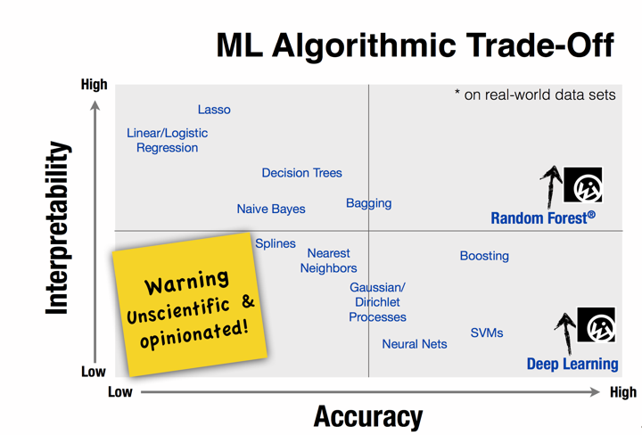
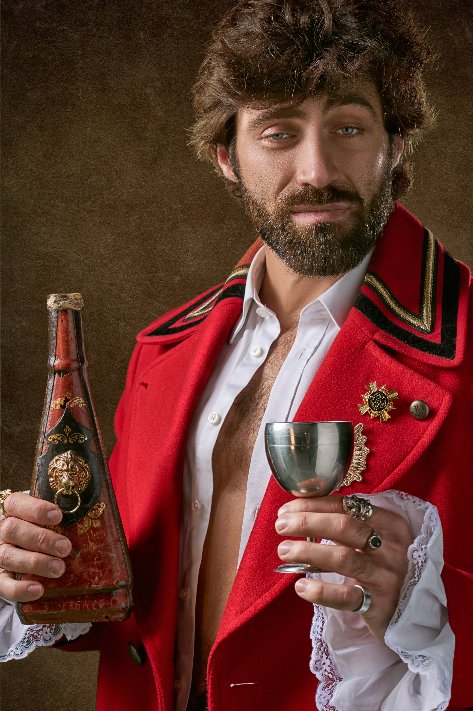

```{r setup, include=FALSE}
knitr::opts_chunk$set(echo = FALSE, warning = FALSE, message = FALSE, eval = TRUE)
library(caret)
library(randomForest)
library(doParallel)
# library(factoextra)
library(gridExtra)
library(cluster)
library(dendextend)
library(ggthemes)
library(huxtable)
library(tidyverse)
library(plotly)
library(kableExtra)
library(RColorBrewer)
library(ggfortify)

opts <- options(knitr.kable.NA = "")
# load wine data
dat <- read.delim("../data/winequality-red.csv", sep = ";") %>% 
  as_tibble()

dat <- dat %>% 
  mutate(quality_cat = factor(ifelse(quality <= 5, "low", "high")))

dat_long <- dat %>% 
  gather(var, val, -c(quality, quality_cat))

palette = "Set1"

# functions
post_resample <- function(fit, newdata, response,  model, param) {
  pred <- predict(fit, newdata)
  res<- postResample(pred = pred, obs = newdata[[response]]) %>% 
    enframe() %>% 
    spread(name, value) %>% 
    mutate(model = !!model, 
           param = !!param) %>% 
    select(model, param, everything()) %>% 
    kableExtra::kable()
  
  
  pred
}

my_kable <- function(x, ...) {
    kable(x) %>% 
    kable_styling(bootstrap_options = c("striped", "hover"), ...)
}

```

---

## Overview

--

- Explore the data

--

- Discuss the two models chosen and why

--

- Explain the use of each

--

- Compare results

---

## The data, the aim

- 1599 observations
- 11 continuous variables covering variety of measurements in wine
- 1 ordinal variable rating the quality of wine (3-8)
- Two levels of quality:
  - <= 5 "low" quality wine
  - \> 5 "high" quality wine

--

- The task: 
  - to use the data provided to train a model and predict wine quality ("high" or "low") (*classification problem*)
  - to compare performance of two models 
  - to explain which features contribute to the quality of wine.

---

## Distribution of wine quality

```{r}
p <- dat %>% 
  count(quality_cat, quality) %>% 
  ggplot(aes(quality, n, fill = quality_cat, text = str_glue("{quality_cat}\nQuality: {quality}\nCount: {n}"))) + 
  geom_col() +
  theme_minimal() + 
  scale_fill_brewer(palette = palette) +
  labs(x = "Quality") + 
  theme(legend.position = "none")

ggplotly(p, tooltip = "text") %>% 
  config(displayModeBar = FALSE)


```

---

## Correlations between features

.plot[
```{r}

cor <- cor(dat %>% select(-c(quality_cat, quality))) 
corrplot::corrplot(cor, type = "lower", order = "FPC", tl.col = "black", tl.srt = 45, col = brewer.pal(n = 8, name = "PuOr"))


```
]

???
correlations between:
- total and free sulfur dioxide
- fixed acidity and citric acid
- citric acid and volatilty
- alcohol and density
- density and fixed acidity

---


## Which features provide the most "information"?

.plot[
```{r}
dat_norm <- preProcess(dat, method = c("center", "scale")) %>% 
  predict(dat)
pca <- prcomp(dat_norm %>% select(-c(quality, quality_cat)), scale. = TRUE)
quality_cat <- as.factor(dat$quality_cat)


p <- autoplot(pca, data = dat_norm, colour = 'quality_cat',
         loadings = TRUE, loadings.colour = 'black', frame.type = 'norm', frame= TRUE, loadings.label.colour = "black",
         loadings.label = TRUE, loadings.label.size = 3) + 
  geom_vline(xintercept = 0, linetype = 2, colour = "grey") +
  geom_hline(yintercept = 0, linetype = 2, colour = "grey") +
  scale_colour_brewer(palette = "Set1") +
  theme_minimal() +
  theme(legend.position = "none")
  
ggplotly(p) %>% 
  config(displayModeBar = FALSE)


```
]

---

.plotly[
```{r}
# quality against all
qual_x_all <- dat_long %>% 
  ggplot(aes(val, quality, colour = quality_cat)) + 
  geom_jitter(aes(text = str_glue("{quality_cat}\nQuality: {quality}\n{var}: {val}")), show.legend = FALSE, alpha = 0.1) +
  geom_smooth(colour = 'black', linetype = 2, method = "lm", se = FALSE) +
  facet_wrap(~ var, scales = "free_x",nrow = 4) + 
  theme_minimal() + 
  theme(axis.text.x = element_blank(), 
        axis.ticks.x = element_blank()) +
  scale_colour_brewer(palette=palette) +
  labs(x = NULL, y = "Quality", title = "Linear trends") 

ggplotly(qual_x_all, tooltip = "text", height = 700) %>% 
  config(displayModeBar = FALSE) %>% 
  layout(legend = list(orientation = "h", x = 0.2, y =-0.2))
```
]

---

<!--
## Distributions in alcohol, acid volatility and sulphates

```{r}
box <- dat %>% 
  select(quality_cat, quality, alcohol, sulphates, volatile.acidity) %>%
  gather(var, val, -starts_with("quality")) %>% 
  mutate(quality_cat = fct_relevel(quality_cat, c("low", "high"))) %>% 
  ggplot(aes(quality_cat, val, colour=quality_cat)) + 
  geom_boxplot(colour = "black")+
  geom_jitter(aes(text= str_glue("Quality: {quality}\n{var}: {round(val, 2)}")), alpha = 0.3) +
  scale_colour_brewer(palette = palette) + 
  theme_minimal() + 
  theme(legend.position = 'none') + 
  facet_wrap(~var, scales = "free_y") +
  labs(x = NULL, y = NULL)

ggplotly(box, tooltip = "text") %>% 
  config(displayModeBar = FALSE)

```

-->

## Choosing the "right" model

.pull-left[

### My priorities

- Accurately predict the quality ("low" or "high") of vinho verde red wines 
- Identify the main features of a good wine, not just whether it is good or not
- Maintain explainability without compromising accuracy. 

]




---

## Choosing the "right" model 

.pull-left[
### Models selected
- Logistic regression
- Random forest
]

--

.pull-right.inverse[
### Models not selected
- K-nearest neighbours
- Simple decision trees 
- Bagged trees
- Artificial neural networks 
- Support vector machines.
]

---

## Why these models?

- Two models that take very different approaches and comparing the results. 
  - One parametric; the other, nonparametric
  - One inflexible ("biased"); the other, flexible ("non-biased")
- What will the results tell us about the data?

  
--

- Advantages of LR: 
  - intuitive probability framework of maximum likelihood
  - low variance, sometimes improving prediction performance
  - output is simple to interpret
  - helps identifying the most significant features that explain the quality of wine (the "explainability" factor)

--

- Advantages of RF:
  - is good when there are lots of features, some of which are
correlated
  - despite being more of a "black box" than LR, RF provides the ability to determine the most important variables, helping with model explainability.

???
And why not the others?

- KNN is a very effective model for classification, however the results are
not easily interpreted against the original problem. 
- Simple decision trees and bagging are inferior versions of random forests.
- Similar to KNN, SVM are complex to explain the results. They are also difficult
to train well, choosing the right kernel and parameters.
- ANNs are highly complex and don't lend easily to explaining the results, 
despite being a very effective classifier.


---

## LR vs RF 

### Couronne, Probst and Boulesteix (2018)

- Of 260 datasets with a binary response, RF preformed better in terms of accuracy 69% of the time. 
- Accuracy $\mu$ ( $\sigma$ ): LR 82% (14); RF 85% (14)
- Very dependent on datasets used for benchmarking
- RF performs better than LR when there are correlations between features (multicollinearity) or when there is a non-linear relationship with the features and the odds
- RF tends to perform better as *p* and $\frac{p}{n}$ increase

---

## Predicting wine quality

```{r}
set.seed(123)

dat <- dat %>% 
  select(-c(quality))

# 2:3 split
intrain <- createDataPartition(dat$quality_cat, p = 2/3, list = FALSE)

train <- dat[intrain,]
test <- dat[-intrain,]
fitControl <- trainControl(method = "repeatedcv", number = 10, repeats = 3)
```

*Testing framework*:
- Splitting the data into training (2/3) and test sets (1/3)

*Resampling method*:
- 10-fold cross validation is used when fitting both models, with three repeats
- Intention for test error estimates:
  - k = 10: lower bias
  - repeats = 3: lower variance

---

## Random Forest fit
```{r}

# Random forest

fit_rf <- readRDS("../data/fit_rf.rds")

res_rf <- map_df(names(fit_rf), 
                 ~{
                   out <- fit_rf[[.x]]$results %>% 
                     mutate(n.trees = str_extract(!!.x, "\\d+"), 
                            model = "Random Forest")
                   out
                   }) 

suppressWarnings(summary_accuracy_rf <- res_rf %>% 
  group_by(n.trees, mtry) %>% 
  summarise(Accuracy = mean(Accuracy)) %>% 
  ggplot(aes(as.numeric(n.trees), Accuracy, group = factor(mtry), colour=factor(mtry))) +
  geom_line() +
  geom_point(aes(text = str_glue("Features #: {mtry}\nTrees #: {n.trees}\n{round(Accuracy, 2)}"))) + 
  scale_color_brewer(palette = palette) + 
  theme_minimal() +
  labs(colour = "mtry", y = "Accuracy", x = "n trees") + 
  theme(legend.position = "bottom"))

### error rates
train_rf <- map2_df(fit_rf, 
                   names(fit_rf), 
                   ~post_resample(.x, train, "quality_cat", "Random Forest", param = .y))

test_rf <- map2_df(fit_rf, 
                   names(fit_rf), 
                   ~post_resample(.x, test, "quality_cat", "Random Forest", param = .y))

err_rates_rf <- data.frame(
  ntrees = names(train_rf),
  train_error = map_dbl(train_rf, ~ 1 - mean(.x == train$quality_cat)), 
  test_error = map_dbl(test_rf, ~1 - mean(.x == test$quality_cat))
) 

```

- The RF best model is chosen after fitting a variable number of trees and features.

*Tuning parameters*:
- **ntrees**: 50, 500, 1000, 2500, 5000 and 10000
- **mtry**: 2, 4, 6, 8 and 10
  
---

## Random Forest fit

```{r}
ggplotly(summary_accuracy_rf, tooltip = "text", width = 800, height = 500)  %>% 
  config(displayModeBar = FALSE) %>% 
  layout(legend = list(orientation = "h", x = 0.2, y =-0.2))
```

---

## Logistic regression _p_("low")

```{r}
fit_logit <- train(quality_cat ~ .,
                   data=train,
                   method="glm",
                   trControl = fitControl,
                   family="binomial")


broom::tidy(fit_logit$finalModel) %>% 
  mutate(term = case_when(p.value < 0.001 ~ str_c(term, "**"), 
                          p.value < 0.5 ~ str_c(term, "*"),
                          TRUE ~ term)) %>% 
  mutate_if(is.numeric, ~round(., 3)) %>% 
  my_kable(full_width = FALSE)

fit_logit_sub <- train(
  quality_cat ~ volatile.acidity + chlorides+ total.sulfur.dioxide + sulphates + alcohol,
  data=train,
  method="glm",
  trControl = fitControl,
  family="binomial"
)

fit_logit_alchl <- train(quality_cat ~ alcohol,
                         data=train,
                         method="glm",
                         trControl = fitControl,
                         family="binomial")

```

---

## Logistic regression

.pull-left[
Trialling three options: 
- use all predictor variables 
- use a subset chosen using forward stepwise selection, leaving:
  - alcohol
  - volatile.acidity
  - sulphates
  - total.sulfur.dioxide
  - citric.acid
  - ~~free.sulfur.dioxide~~
  - ~~fixed.acidity~~
  - ~~chlorides~~
- use only "Alcohol" to predict quality (wild card!)
]

.pull-right[
- Using a generous classification algorithm:
  - _p_("low") > 0.5, else "high"
]

???

recall from above,the correlation between free and total sulfur dioxide (which are complements of each other probably), so just using total sulfur dioxide. 
Likewise just using volatile acidity and not fixed acidity as well. 
Chlorides and sulfates also correlated - didn't know "It appears that, in many cases, it is the relative ratio of the two ions that has the major flavor influence"

---


## Logistic regression 

```{r}

aov_all <- anova(fit_logit$finalModel, test="Chisq") 
res_dev_all <- pchisq(aov_all[1,4], aov_all[1,3], lower.tail = F)
aov_sub <- anova(fit_logit_sub$finalModel, test="Chisq") 
res_dev_sub <- pchisq(aov_sub[1,4], aov_sub[1,3], lower.tail = F)
aov_alchl <- anova(fit_logit_alchl$finalModel, test="Chisq") 
res_dev_alchl <- pchisq(aov_sub[1,4], aov_sub[1,3], lower.tail = F)

pred_logit <- function(fit, test, train) {
  logit_pred_test <- predict(fit, newdata = test, type = "response")
  logit_pred_test <- ifelse(logit_pred_test  <= 0.5, "high", "low")
  logit_pred_train <- predict(fit, newdata = train, type = "response")
  logit_pred_train <- ifelse(logit_pred_train  <= 0.5, "high", "low")
  
  logit_err_test <- 1 - mean(logit_pred_test == test$quality_cat)
  logit_err_train <- 1 - mean(logit_pred_train == train$quality_cat)
  list(logit_err_test = logit_err_test, 
       logit_err_train = logit_err_train, 
       logit_pred_test = logit_pred_test)
}

pred_logit_all <- pred_logit(fit_logit$finalModel, test, train)
pred_logit_sub <- pred_logit(fit_logit_sub$finalModel, test, train)
pred_logit_alchl <- pred_logit(fit_logit_alchl$finalModel, test, train)

err_rates_logit <- tibble(
  `Feature selection` = c("All", "Subset", "Alcohol only"),
  train_error = map_dbl(c(pred_logit_all$logit_err_train, pred_logit_sub$logit_err_train, pred_logit_alchl$logit_err_train), ~round(.x, 3)), 
  test_error = map_dbl(c(pred_logit_all$logit_err_test, pred_logit_sub$logit_err_test, pred_logit_alchl$logit_err_test), ~round(.x, 3))
) 

tibble(
  `Feature selection` = c("All", "Subset", "Alcohol only")#, 
  # `Res. deviance p-value` =  "< 0.001"#c(res_dev_all, res_dev_sub)
) %>% 
  inner_join(err_rates_logit, "Feature selection") %>% 
  rename(`Train error` = train_error, 
         `Test error` = test_error) %>% 
  arrange(`Test error`) %>% 
  kable(digits = 100) 

```


???

since the p-value for the resid deviance on a chi-squared distribution is less than 0.05, 
The logistic regression model is ineffective at providing explanation of the features that influence wine quality 

Further, fitting only influential predictors worsens the test error result. 

---

class: center, inverse

## Comparing the "best drops"...

---

## Error rates

```{r}

err_rates_rf %>% 
  filter(test_error == min(test_error)) %>% 
  mutate(model = "Random forest") %>% 
  slice(1) %>% 
  rename(param = ntrees) %>% 
  bind_rows(err_rates_logit %>%
              filter(test_error == min(test_error)) %>% 
              mutate(model = "Logit", 
                     param = "Subset") %>% 
            select(-`Feature selection`)) %>% 
  select(model, everything()) %>% 
  rename(`Train error` = train_error, 
         `Test error` = test_error) %>% 
  my_kable()
```

???

- Comparing RF and LR, LR does particularly poorly
- Likely due to the interactions between features

---

## Confusion matrix 
```{r}

confusionMatrix(test$quality_cat, factor(test_rf$`ntree = 1000`))$table %>% 
  broom::tidy() %>% 
  group_by(Reference) %>% 
  mutate(total = sum(n), 
         `%` = round(n/total * 100, 2)) %>% 
  select(-total) %>% 
  select(Reference, everything()) %>% 
  ungroup() %>% 
  cbind(
    confusionMatrix(test$quality_cat, factor(pred_logit_all$logit_pred_test))$table %>% 
      broom::tidy() %>% 
      group_by(Reference) %>% 
      mutate(total = sum(n), 
             `%` = round(n/total * 100, 2))%>% 
      ungroup() %>% 
      select(-c(Prediction, Reference, total)) 
  ) %>% 
  my_kable(full_width = FALSE) %>% 
  add_header_above(c(" " = 2, "Random Forest" = 2, "Logistic regression" = 2))
```

---

## Variable importance

.plot[
```{r}

varimp_rf <- as.data.frame(varImp(fit_rf$`ntree = 1000`$finalModel)) %>% 
  rownames_to_column() %>%
  select(Predictors = rowname, Overall) %>% 
  arrange(-Overall) %>% 
  mutate(sum = sum(Overall), 
         proportion = Overall/sum, 
         model = "Random Forest") 
varimp_lr <- as.data.frame(varImp(fit_logit$finalModel)) %>% 
  rownames_to_column() %>%
  select(Predictors = rowname, Overall) %>% 
  arrange(-Overall) %>% 
  mutate(sum = sum(Overall), 
         proportion = Overall/sum, 
         model = "Logistic Regression")
  
p <- bind_rows(varimp_rf, varimp_lr) %>% 
  # select(model, Predictors, proportion) %>%
  mutate(Predictors = fct_reorder(Predictors, proportion)) %>% 
  ggplot(aes(Predictors, proportion, fill = model, text = str_glue("{Predictors}\nOverall: {round(Overall, 2)}\nProportional:{round(proportion, 2)}"))) +
  geom_bar(position = "dodge2", stat= "identity") + 
  # geom_segment( aes(y=Predictors, yend=Predictors, x=0, xend=proportion)) + 
  theme_minimal() +
  scale_fill_brewer(palette = palette) +
  coord_flip() +
  labs(y = "Importance (standardised)", x = NULL, fill = NULL) + 
  theme(legend.position = "bottom")

p
```
]

???

variable importance of LR: the absolute value of the coefficients corresponding the the tuned model are used.

---

## Conclusions

.pull-left[
- Random forest performs much, much better when predicting wine quality
- Why does LR perform so poorly?
  - Collinearity between predictors weakens the LR performance
  - Relationships between predictors and the "high" / "low" odds are not linear
- But LR is not wasted! It supports the qualitative findings from RF. 
- Most important variables for predicting wine quality: 
  - alcohol, acid volality, sulphates and sulfur dioxide

]

.pull-right.right_img[

]

---

## Cheers...

### References

Couronné R, P Probst, A-L Boulesteix, 2018, _Random forest versus logistic regression: a large-scale benchmark experiment_, BMC Bioinformatics, Vol 19, DOI: 10.1186/s12859-018-2264-5

### Images

- [Photo by Pixabay from Pexels](https://www.pexels.com/photo/farm-land-during-sunset-51947/)
- [Photo by JJ Jordan from Pexels](https://www.pexels.com/photo/man-holding-red-and-black-bottle-3115350/)
